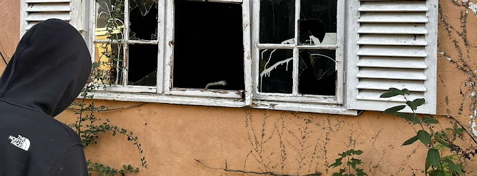

## 🗞 Banner

## 🗂️ 𝗛𝗶𝗴𝗵𝗹𝗶𝗴𝗵𝘁 𝗣𝗿𝗼𝗷𝗲𝗰𝘁𝘀

# 📊 𝗚𝗶𝘁𝗛𝘂𝗯 𝗦𝘁𝗮𝘁𝘀:
 
 
 

## 🏆 𝗚𝗶𝘁𝗛𝘂𝗯 𝗧𝗿𝗼𝗽𝗵𝗶𝗲𝘀

# 💻 𝗧𝗲𝗰𝗵 𝗦𝘁𝗮𝗰𝗸:

  

  

  

  

  

  

## 💜 Vouches 

Context all of these vouches are from discord were I sell video game cheats ive made.
- Rainbow 6 siege
- Call Of Duty cold war (unlock all)
- Minecraft Java
- Comabat master 
- Redmatch 2

    
    
    
    
    
    
     
    
    
    

