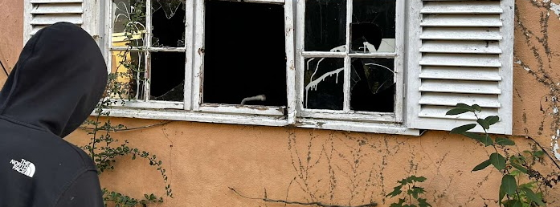

## 🗞 Banner 

## 🗂️ 𝗛𝗶𝗴𝗵𝗹𝗶𝗴𝗵𝘁 𝗣𝗿𝗼𝗷𝗲𝗰𝘁𝘀
<table>
  <tr>
    <td>
      
    </td>
    <td>
      
    </td>
  </tr>

  <tr>
    <td>
      
    </td>
    <td>
      
    </td>
  </tr>

  <tr>
    <td>
      
    </td>
    <td>
      
    </td>
  </tr>
</table>

# 📊 𝗚𝗶𝘁𝗛𝘂𝗯 𝗦𝘁𝗮𝘁𝘀:

## 🕛 𝗖𝗼𝗱𝗲 𝗦𝘁𝗮𝘁𝘀

